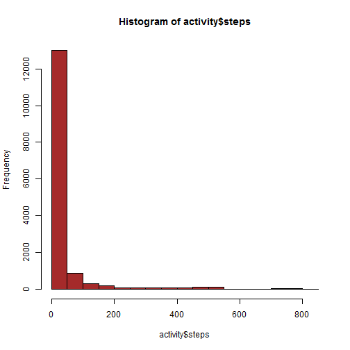
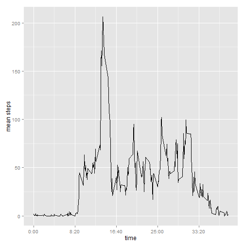
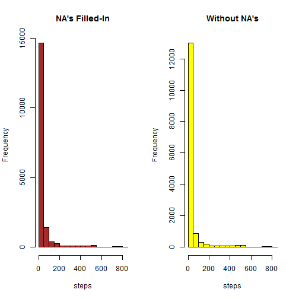
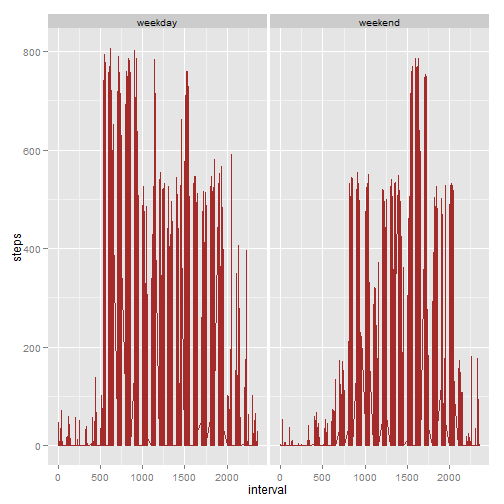

Data for this assignment is the [Activity monitoring data](https://d396qusza40orc.cloudfront.net/repdata%2Fdata%2Factivity.zip).  

Variables contained in this dataset are:  

> * steps: Number of steps taken in a 5-minute interval  
> * date: Date on which the measurement was taken, formatted in YYYY-MM-DD  
> * interval: Identifier for the 5-minute interval in which measurement was taken.  
   
****

## Loading and preprocessing the data

Download and unzip the dataset. Use Binary versions of **getURL** and **write** as the data is in zip/binary form.  


```r
library(bitops)
library(RCurl)
arch_data <- getBinaryURL("https://d396qusza40orc.cloudfront.net/repdata%2Fdata%2Factivity.zip", 
               ssl.verifypeer=0L, followlocation=1L)
writeBin(arch_data,"repdata-data-activity.zip")
unzip("repdata-data-activity.zip")
```


The zip file yields the file activity.csv.  

Load the dataset into a variable.


```r
activity = read.csv('activity.csv', header=TRUE,sep=",",na.strings="NA")

## examine the data contents 
str(activity)
```

```
## 'data.frame':	17568 obs. of  3 variables:
##  $ steps   : int  NA NA NA NA NA NA NA NA NA NA ...
##  $ date    : Factor w/ 61 levels "2012-10-01","2012-10-02",..: 1 1 1 1 1 1 1 1 1 1 ...
##  $ interval: int  0 5 10 15 20 25 30 35 40 45 ...
```

****
## What is the mean total number of steps taken per day?

(1) Plot a histogram of the total number of steps taken each day  


```r
hist(activity$steps, col='brown')
```

 

Shows a lot of zeroes more than any other value.
  
  
  
(2) ..and calculate the mean ...

```r
## exclude missing values from mean calculation
mean(activity$steps,na.rm=TRUE)
```

```
## [1] 37.3826
```
  
  
Ok, now the median. 

```r
median(activity$steps,na.rm=TRUE)
```

```
## [1] 0
```

****

## What is the average daily activity pattern?

(1) Make a time series plot (i.e. type="l") of the 5-minute interval (x-axis) and the average number of steps taken averaged across all days (y-axis)
  
  
Preprocess the data set to create average number of steps per 5-minute interval.


```r
library(dplyr)

## start with a data frame for dplyr
activity.df <- tbl_df(activity)

## create a data set containing avg steps per 5-minute interval
MeanSteps <- activity.df %>%
                group_by(interval) %>%
                summarise(mean_steps = mean(steps, na.rm=TRUE))
```
   
   
Okay. So let's see what we got.

```r
str(MeanSteps)
```

```
## Classes 'tbl_df', 'tbl' and 'data.frame':	288 obs. of  2 variables:
##  $ interval  : int  0 5 10 15 20 25 30 35 40 45 ...
##  $ mean_steps: num  1.717 0.3396 0.1321 0.1509 0.0755 ...
##  - attr(*, "drop")= logi TRUE
```

  
  
Create a function that will convert the minutes into hh:mm format.


```r
mins2hhmm <- function(x) {
    h <- floor(x/60)
    m <- floor(x %% 60)
    hhmm <- sprintf("%d:%02d", h, m)
    return(hhmm)
}
```

  
Plot the average steps per interval

```r
library(ggplot2)
ggplot(MeanSteps,aes(x=interval,y=mean_steps)) + geom_line() +
    scale_x_continuous(name="time",labels=mins2hhmm) +
    ylab('mean steps')
```

 


(2) Which 5-minute interval, on average across all the days in the dataset, containsthe maximum number of steps?

That would be ..

```r
MeanSteps %>% filter(mean_steps == max(mean_steps))
```

```
## Source: local data frame [1 x 2]
## 
##   interval mean_steps
## 1      835   206.1698
```


The highest average-steps is   206.17, at interval 835.


****

## Inputting Missing values

(1) Count the number of NA's:


```r
## count rows where Steps is NA
length(activity.df[is.na(activity.df[,c('steps')])])
```

```
## [1] 2304
```

(2) Strategy to fill in missing values: 
> * attach the mean_steps column from MeanSteps, to the data frame Activity data set. 
> * Fill-in NA's with the mean steps (all days per interval)

This is implemented as follows:


```r
## link data set containing NA's with
## data set containing mean steps per interval
activ_noNA <- merge(activity.df,MeanSteps, by="interval")

str(activ_noNA)
```

```
## 'data.frame':	17568 obs. of  4 variables:
##  $ interval  : int  0 0 0 0 0 0 0 0 0 0 ...
##  $ steps     : int  NA 0 0 0 0 0 0 0 0 0 ...
##  $ date      : Factor w/ 61 levels "2012-10-01","2012-10-02",..: 1 54 28 37 55 46 20 47 38 56 ...
##  $ mean_steps: num  1.72 1.72 1.72 1.72 1.72 ...
```

(3) Then, perform a conditional assignment to replace NA's with the mean values per interval. Create the new complete cases data set, activ_noNA.  


```r
## assign mean to replace NA's
activ_noNA <- activ_noNA %>% mutate(steps = ifelse(is.na(steps),mean_steps,steps))
```


```r
## check if there are still NA's on the new data frame
length(activ_noNA[is.na(activ_noNA[,c('steps')])])
```

```
## [1] 0
```

```r
str(activ_noNA)
```

```
## 'data.frame':	17568 obs. of  4 variables:
##  $ interval  : int  0 0 0 0 0 0 0 0 0 0 ...
##  $ steps     : num  1.72 0 0 0 0 ...
##  $ date      : Factor w/ 61 levels "2012-10-01","2012-10-02",..: 1 54 28 37 55 46 20 47 38 56 ...
##  $ mean_steps: num  1.72 1.72 1.72 1.72 1.72 ...
```

activ_noNA now has complete cases only.  


(4) Make a histogram of the new data set, compared against the original.


```r
par(mfrow=c(1,2))
hist(activ_noNA$steps,main="NA's Filled-In", xlab="steps", col="brown")
hist(activity$steps, main="Without NA's", xlab="steps", col="yellow")
```

 

It looks like the number of Zero steps increased further than the non-zero steps. Let's see if it made a difference in the Mean and Median values.


```r
## calculate mean
mean(activ_noNA$steps)
```

```
## [1] 37.3826
```

```r
median(activ_noNA$steps)
```

```
## [1] 0
```

Data Set | Mean | Median
--------|---------|------------
With NA | 37.3825996 | 0
Without NA | 37.3825996  | 0  

From the above results the **mean** and **median** values look unchanged. There is no discernible impact, possibly because the number of zero-steps are significantly larger than the rest of the values.

***

## Are there differences in activity patterns between weekdays and week-ends?

(1) Create a new factor, isWeekend.

```r
## to be less cryptic, breakdown the creation of the 
## new factor into 2 steps
activ_noNA$weekday <- weekdays(as.Date(activ_noNA$date))

## now weekday values to create isWeekend
activ_noNA$isWeekend <- factor(ifelse(activ_noNA$weekday == 'Saturday' | activ_noNA$weekday == 'Sunday','weekend', 'weekday'))

## and cleanup
activ_noNA$weekday <- NULL

## let's see what we got
str(activ_noNA)
```

```
## 'data.frame':	17568 obs. of  5 variables:
##  $ interval  : int  0 0 0 0 0 0 0 0 0 0 ...
##  $ steps     : num  1.72 0 0 0 0 ...
##  $ date      : Factor w/ 61 levels "2012-10-01","2012-10-02",..: 1 54 28 37 55 46 20 47 38 56 ...
##  $ mean_steps: num  1.72 1.72 1.72 1.72 1.72 ...
##  $ isWeekend : Factor w/ 2 levels "weekday","weekend": 1 1 2 1 2 1 2 1 1 2 ...
```


(2) Plot the data set.

```r
p <- ggplot(activ_noNA, aes(x=interval, y=steps)) + geom_line(colour='brown')
## make it a 2-plot panel on weekend/weekday
p + facet_grid(. ~ isWeekend)
```

 

Weekdays exhibit more steps above 600 than weekends. And the steps on weekdays are skewed earlier than weekends.
